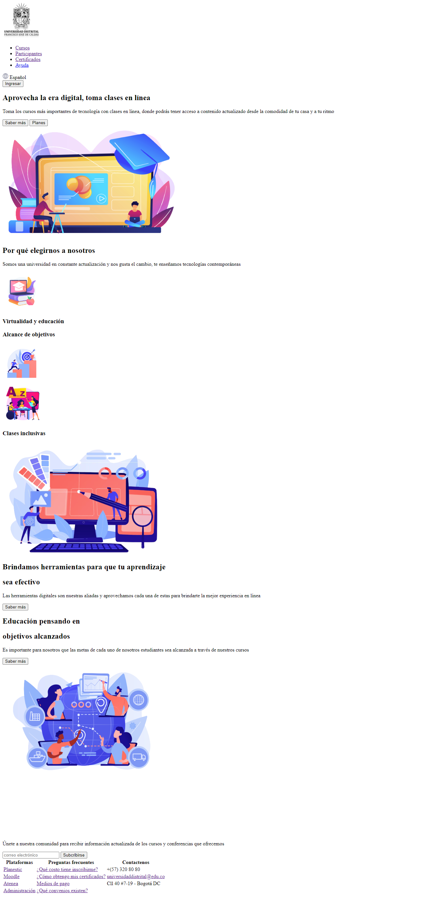

<h1>Taller 9 Ibeth Vanessa Diaz Reyes</h1>

<h2> Información</h2>

Curso: full Stack Basico - Grupo 1

Profesor: Cristian Patiño

<h2> Punto 1: Link figma</h2>

<a href="https://www.figma.com/file/zu3spgg0G7NoGmWohZbomW/Vanesa-Diaz--proyecto-figma?type=design&node-id=3%3A4&mode=design&t=hNtb8PTXkXIpkOiJ-1" target="_blank">Link de Figma</a>

<h2>Punto 2: HTML</h2>
