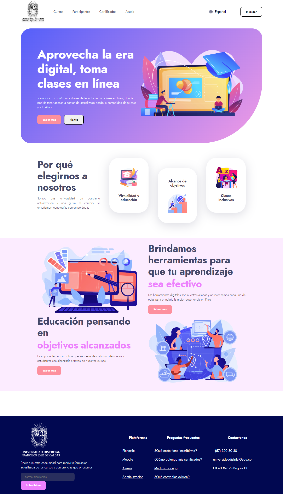

<h1>Taller 9 Ibeth Vanessa Diaz Reyes</h1>

<h2> Información</h2>

Curso: full Stack Basico - Grupo 1

Profesor: Cristian Patiño

<h3>Link Página Web</h3>
<a href="https://vanedr-624.github.io/taller-9-full-stack/" target="_blank">Link página web</a>

<h2> Punto 1: Link figma</h2>

<a href="https://www.figma.com/file/zu3spgg0G7NoGmWohZbomW/Vanesa-Diaz--proyecto-figma?type=design&node-id=3%3A4&mode=design&t=hNtb8PTXkXIpkOiJ-1" target="_blank">Link de Figma</a>

<h2>Punto 2: HTML</h2>

<h2>Punto 3: CSS</h2>

<h2>Punto 4: Titulos</h2>
 

<h2>Punto 5: Estilos de texto </h2>

<h2>Punto 6: Enlaces </h2>

<h2>Punto 7 y 8: Navegación </h2>

<h2>Punto 9: Tablas</h2>

